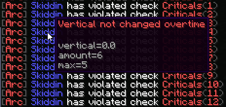

# Arc
Arc is an anticheat built to support older PvP versions and newer game versions.

* Supports 1.8.8, 1.12.2 and 1.16.5
* Customizable check configurations
* Extensive configuration
* Extensive permissions
* Performant
* API
##

* Customizable violation messages
* Customizable violation parameters
* Customizable violation actions
* Customizable notify levels for each check
* Hovering debug system
* Violation data kept on logout
* Notified on player kicks/bans
* Ability to toggle on/off

##

* WIP Inventory management system
* Toggle violations
* Reload configuration
* View timings

... and more!

# Installing
* Arc *requires* Java 8.
* Arc *requires* ProtocolLib
* Compatible with Spigot and PaperSpigot!

# Checks

* `Combat` checks
  * KillAura
    * Direction
    * Attack Speed
    * WIP.
  * Criticals
  * Reach
  * NoSwing
* `Moving` checks
  * Flight
    * Contains multiple related checks but is still WIP.
  * NoFall
  * MorePackets
  * Jesus
* `Network` checks
  * Swing packet checking
  * Payload packet checking
* `Player` checks
  * Regeneration
  * FastUse
    * FastBow
    * FastConsume

*...All checks are still work in progress and subject to change*

# Development

View the [trello board](https://trello.com/b/Ytgv320C/arc) to see in-progress items and TODO.

* You can submit pull requests at any time to implement a feature or change.
  * Please ensure the code is quality and readable
  * Be sure to thoroughly test and make sure no other systems interfere.
  * Documentation should be included.

* To work on Arc yourself, the following things are required:
  * A PaperSpigot 1.8 jar with NMS.
  * A CraftBukkit 1.15.2 jar - which can be obtained from BuildTools using `--compile craftbukkit`
  * A CraftBukkit 1.16.5 jar - which can be obtained from BuildTools using `--compile craftbukkit`
  * Each CraftBukkit jar must be placed in their respective `bridgex_x` directory.

# Documentation

All the documentation is still work-in-progress and very incomplete.

Although, most things within the code are very clear and documented.

* Here are the various documentation links
  * [Commands](https://github.com/Vrekt/Arc/wiki/Commands) 
  * [API](https://github.com/Vrekt/Arc/wiki/API)
  * [Configuration](https://github.com/Vrekt/Arc/wiki/Configuration)
  * [Check Configuration](https://github.com/Vrekt/Arc/wiki/Check-configuration)
