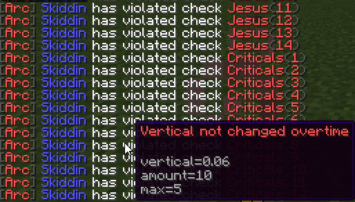

# Arc
Arc is an anticheat built to support older PvP versions and newer game versions.

* Supports 1.8.8, 1.15.2 and 1.16.4
* Customizable check configurations
* Extensive configuration
* Extensive permissions
* Performant
* API

* Customizable violation messages
* Custom parameters
* Debug information

## Installing Arc

* ProtocolLib is **required**.
* Arc requires Java 8.
* Spigot or PaperSpigot.

## Current Checks

### Combat
* KillAura
  * Direction
* Criticals
* Reach

### Moving
* MorePackets
* NoFall
* Jesus

### Network
* Swing Frequency
* Payload Frequency

### Player
* Regeneration
* FastUse
  * Fast Consume
  * Fast Bow

# Development

View the trello [here!](https://trello.com/b/Ytgv320C/arc)

You can view in-progress items and things still TODO.
